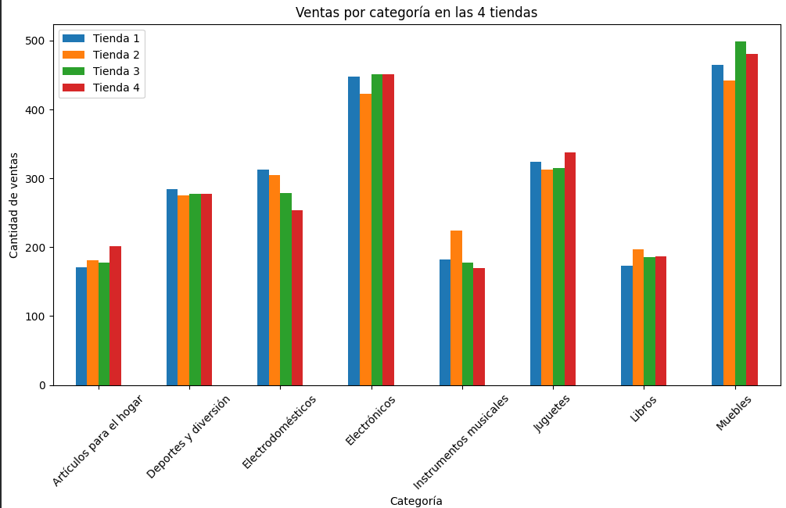
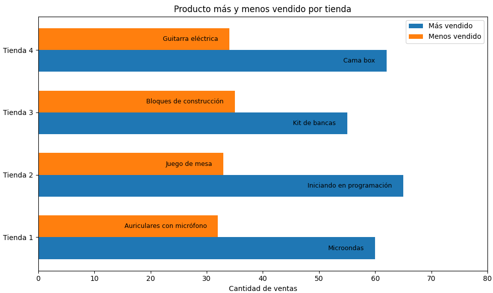
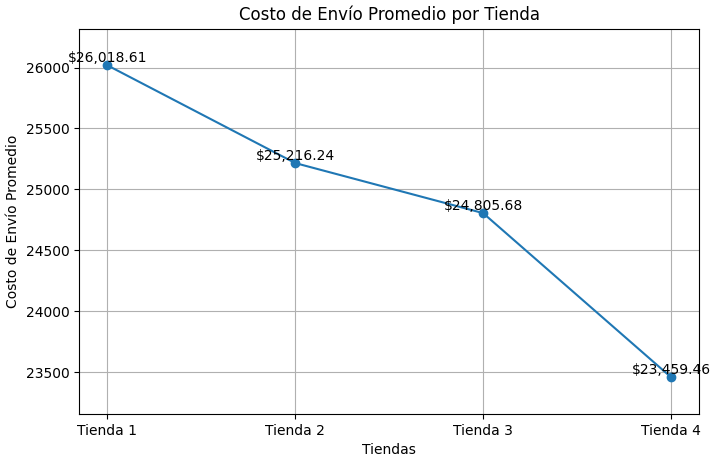
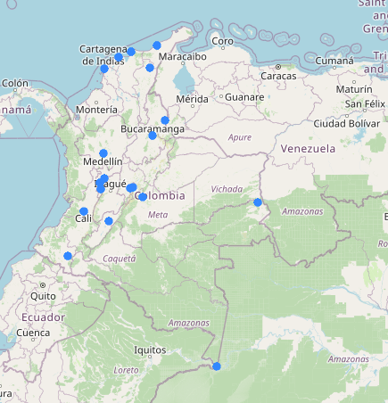

# Challenge-Data-science
# 📊 Análisis de Desempeño de Ventas – Store Alura LATAM

## 🗂 Tabla de Contenido
- [💻 Tecnologías usadas](#tecnologias-usadas)
- [📝 Descripción](#descripcion)
- [⚙️ Desarrollo del proyecto](#desarrollo-del-proyecto)
- [📊 Gráficos](#graficos)
- [🌍 Análisis geográfico](#analisis-geografico)
- [✅ Conclusión](#conclusion)
- [👤 Autor](#autor)

💻 Tecnologías usadas

## 💻 Tecnologías usadas

- Python: pandas, matplotlib, seaborn, folium
- Google Colab: notebook para análisis y visualización
- Excel / Google Sheets: limpieza y preprocesamiento de datos
- GitHub: almacenamiento y versionado del proyecto

## 📝 Descripción
Este proyecto analiza las ventas de las cuatro tiendas de Store Alura LATAM para **evaluar su desempeño y apoyar decisiones estratégicas**.  
Se estudian indicadores clave como facturación, ventas por categoría, satisfacción del cliente, productos más y menos vendidos, costos de envío y distribución geográfica de los clientes.  
- Objetivo: Identificar oportunidades de mejora, productos estrella y tiendas con menor rendimiento para tomar decisiones comerciales informadas.

## ⚙️ Desarrollo del proyecto

| 📌 Análisis | 📝 Descripción | 🎯 Resultado Clave |
|------------|----------------|------------------|
| 💰 Facturación total | Comparación de ingresos de las 4 tiendas. | La Tienda 1 es la que más factura (1,150,880,400), seguida de la Tienda 2 (1,116,343,500), Tienda 3 (1,098,019,600) y Tienda 4 (1,038,375,700). |
| 🛒 Ventas por categoría | Identificación de las categorías más vendidas en cada tienda. | "Muebles" lidera en todas las tiendas, seguida de "Electrónicos" y "Juguetes". |
| ⭐ Calificación promedio | Evaluación de la satisfacción del cliente por tienda. | Tienda 3 tiene la calificación más alta (4.05), Tienda 2 (4.03), Tienda 4 (3.99) y Tienda 1 (3.98). |
| 📈 Productos más/menos vendidos | Productos con mayor y menor volumen de ventas. | Más vendidos: Microondas, Iniciando en programación, Kit de bancas, Cama box. Menos vendidos: Auriculares con micrófono, Juego de mesa, Bloques de construcción, Guitarra eléctrica. |
| 🚚 Costo de envío promedio | Análisis del costo promedio que paga el cliente en cada tienda. | Valores similares entre tiendas, con Tienda 4 ligeramente más alto, impactando su atractivo. |
| 🌍 Análisis geográfico | Distribución de clientes mediante mapa de dispersión con coordenadas reales. | Mayor concentración de ventas en zonas cercanas a las tiendas principales; Tienda 1 y 2 con clientes más dispersos, Tienda 4 con menor densidad de ventas. |

## 📊 Gráficos

### 💰 Facturación total

### 🛒 Ventas por categoría

### ⭐ Calificación promedio

### 📈 Productos más/menos vendidos

### 🚚 Costo de envío promedio

---
## 🌍 Análisis geográfico
Se generó un **mapa de dispersión de clientes** para las cuatro tiendas:  

- 🔴 Zonas de mayor densidad de ventas detectadas cerca de las ubicaciones principales de las tiendas.  
- 📈 Permite planificar y optimizar rutas de entrega.  

## ✅ Conclusión
Señor Juan: Venda la Tienda 4

El análisis permitió identificar:  
- 🏆 La Tienda 1 es la de mayor facturación, mientras que la Tienda 4 es la de menor desempeño.  
- 📍 "Muebles" y "Electrónicos" son las categorías con más ventas.  
- ⭐ La calificación promedio refleja la satisfacción de los clientes, con Tienda 3 liderando en experiencia.  
- 💡 Tienda 4 presenta menor rendimiento global: menos facturación, menor densidad de ventas, productos menos vendidos y costo de envío más alto.  

**Recomendación:**  
- Revisar los costos de envío : Se pueden negociar o reducir para mejorar productividad de las tiendas.
- Mejorar la experiencia del cliente: Brindar mejor atención, menores tiempos de entrega, calidad de los productos especialmente en las tiendas que fueron menor calificadas.

---

## 👤 Autor
**Fernanda Torres**  
Ingeniera Industrial y de Sistemas  
GitHub: https://github.com/Maffert
